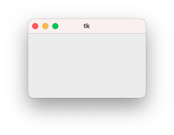

# Tkinter

[Tkinter](https://docs.python.org/3/library/tkinter.html) est une bibliothèque graphique pour Python. Elle permet de créer des interfaces graphiques (GUI) de manière simple et rapide.

## Premiers pas

Sur macOS, il faut probabelemnt installer la librairie `pip install tk`

```py title="Fenêtre basqiue"
--8<--
hello_tk_01.py
--8<--
```



```py title="Deux boutons et un texte"
--8<--
hello_tk_02.py
--8<--
```


## TTk

Les composants `ttk` sont des composants améliorés de Tkinter. Ils sont plus modernes, plus jolis et s'adaptent mieux à l'OS (Operating System). Par exemple, ils utilisent les couleurs du thème de l'OS (mode sombre par exemple).

```py title="Composants ttk"
--8<--
hello_tk_02bis.py
--8<--
```


## Texte editable

```py title="Texte editable"
--8<--
hello_tk_03.py
--8<--
```


```py title="Texte editable + ajout de contenu à la volée"
--8<--
hello_tk_04.py
--8<--
```


